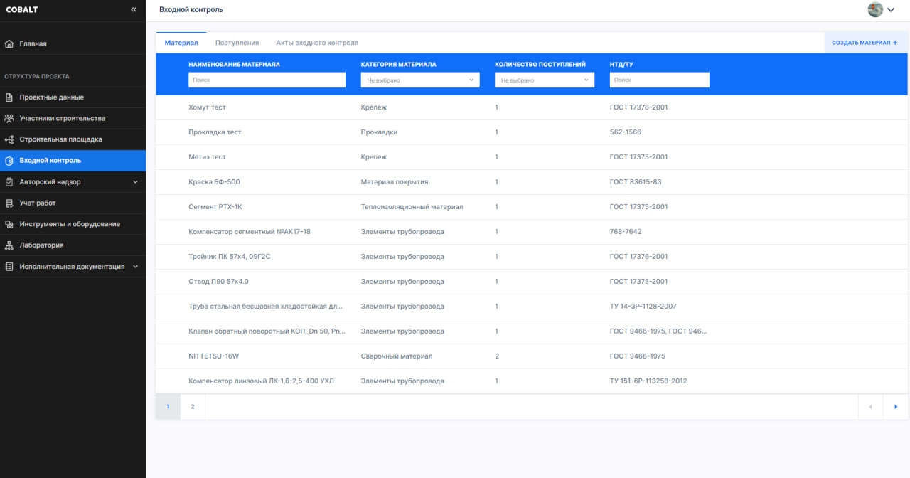

# Otus Kotlin Incoming control

Учебный проект курса [Otus](https://otus.ru) [Kotlin Backend Developer](https://otus.ru/lessons/kotlin/).
Поток курса 2022-12.

Incoming control - это справочник строительных материалов.

Главная задача справочника - дать информацию о том какие строительные материалы существуют в принципе. 

Опциональная задача (при наличии временных ресурсов на разработку) - дать информацию о том какой конкретно материал 
прибыл на стройку (кем выпущен, кем подтверждено качество по итогам заводских испытаний и т.д.).

## Визуальная схема фронтенда

Представленные эскизы являются фронтэнд-представлением программного продукта Cobalt, разрабатываемого АО "Кобальт42",
сопровождающего подготовку пакетов исполнительной документации. В рамках данного учебного проекта предложен вариант
реализации небольшой части функционала программы, позволяющего работать со строительными материалами.

## Документация

1. Маркетинг
   1. [Заинтересанты](./docs/01-marketing/01-stakeholders.md)
   2. [Целевая аудитория](./docs/01-marketing/02-target-audience.md)
   3. [Конкурентный анализ](./docs/01-marketing/03-concurrency.md)
   4. [Анализ экономики](./docs/01-marketing/04-economy.md)
   5. [Пользовательские истории](./docs/01-marketing/05-user-stories.md)
2. DevOps
   1. [Схема инфраструктуры](./docs/02-devops/01-infrastruture.md)
   2. [Схема мониторинга](./docs/02-devops/02-monitoring.md)
3. Тесты
4. Архитектура
   1. [Компонентная схема](./docs/04-architecture/01-arch.md)
   2. [Интеграционная схема](./docs/04-architecture/02-integration.md)
   3. [Описание API](./docs/04-architecture/03-api.md)
